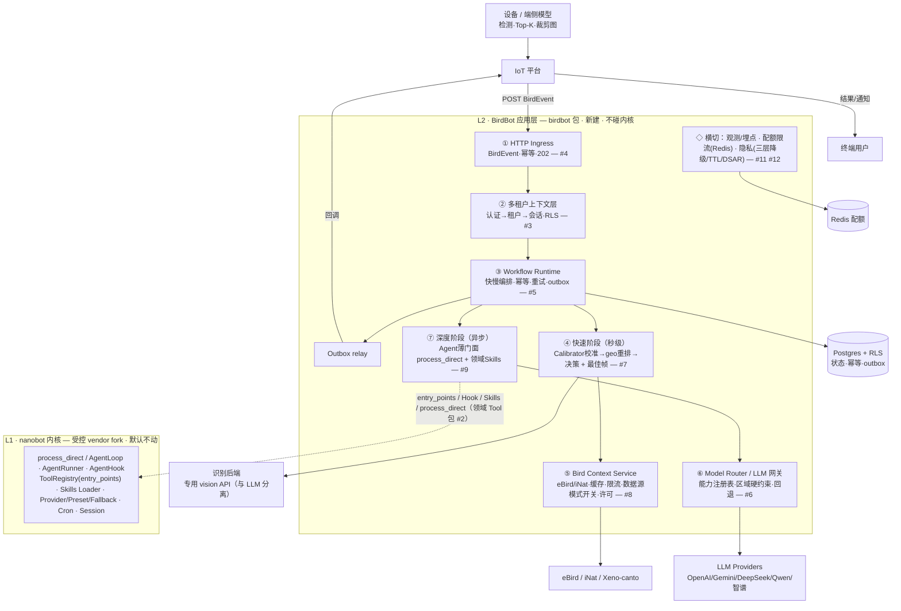

# BirdBot 整体架构图

> 配套：[方案](2026-06-22-birdbot-solution.md) · [术语](../CONTEXT.md) · [ADR](adr/) · [PRD #1](https://github.com/xinzhuwang-wxz/BIRD-BOT/issues/1)
> 两层：**L1 nanobot 内核**（受控 vendor fork，默认不动，[ADR-0001](adr/0001-vendored-nanobot-fork.md)）+ **L2 BirdBot 应用层**（独立 `birdbot/` 包）。圈号=模块，`#N`=GitHub issue。

## 总览（Mermaid，GitHub 可渲染）



## 总览（ASCII 备用）

```text
┌──────────────────────────────────────────────────────────────────────────────┐
│  设备/端侧模型 ──检测/Top-K/裁剪图──▶ IoT 平台 ◀──结果/通知──▶ 终端用户          │
└────────────────────────────────────────┬───────────────────────────────────────┘
                           POST BirdEvent │        ▲ outbox 回调
                                          ▼        │
╔═ L2 · BirdBot 应用层（birdbot 包 · 新建 · 不碰内核）═════════════════════════════╗
║                                                                                ║
║  ① HTTP Ingress ─▶ ② 多租户上下文层 ─▶ ③ Workflow Runtime ─────────────▶ Outbox ║
║    BirdEvent/幂等/202   认证→租户→会话(RLS)   快慢编排·幂等·重试·outbox      回调 ║
║    [#4 S3]              [#3 S2]               [#5 S4]                           ║
║                                  │                                             ║
║              ┌──── 快速阶段(秒级) ┴──────────── 深度阶段(异步) ────┐            ║
║              ▼                                                   ▼            ║
║     ④ Recognition Adapter                            ⑦ Agent 薄门面          ║
║        Calibrator校准→geo重排                           process_direct         ║
║        →决策(rollup/升级)+最佳帧 [#7 S6]                 + 领域 Skills [#9 S8]  ║
║              │           ▲                                 │                   ║
║              ▼           │常见/季节/罕见                    ▼                   ║
║     识别后端(vision API) ⑤ Bird Context Service     ⑥ Model Router / LLM 网关  ║
║     专用·与LLM分离 [#7]    eBird/iNat·缓存·限流          能力注册表·区域硬约束    ║
║                           ·数据源模式开关 [#8 S7]        ·回退 [#6 S5]          ║
║                                                                                ║
║  ◇ 横切：观测/埋点 · 配额限流(Redis) · 隐私(三层降级/TTL/DSAR)  [#11 S10][#12 S11]║
╚════════════════════════════════╤═══════════════════════════════════════════════╝
        entry_points / Hook / Skills / process_direct（领域 Tool 包 [#2 S1]）
                                  ▼
╔═ L1 · nanobot 内核（受控 vendor fork · 默认不动 · ADR-0001）═════════════════════╗
║  process_direct/AgentLoop · AgentRunner · AgentHook · ToolRegistry(entry_points)║
║  Skills Loader · Provider/Preset/Fallback · Cron 调度器 · Session               ║
╚════════════════════════════════╤═══════════════════════════════════════════════╝
                                  ▼
   存储/外部：Postgres(RLS·状态/幂等/outbox) · Redis(配额) · 识别后端
              · eBird/iNat/Xeno-canto · LLM(OpenAI/Gemini/DeepSeek/Qwen/智谱)
```

## 两阶段数据流

```text
快速阶段（秒级，同步 202）：
  BirdEvent → 落库(queued) → 消费端侧 Top-K → Calibrator 校准
  → Bird Context(当地 eBird 频率,命中缓存优先) → geo/temporal 重排 → 决策
  → Frame Scorer 选最佳帧 → 返回候选+校准可信度+最佳帧（落库为深度阶段快照）

深度阶段（异步，后台 worker，可断点续跑）：
  快照 → Agent 薄门面 process_direct(深度 ToolRegistry) + Skill
  → 多模态 LLM(经 Model Router) 收精选帧+结构化证据
  → 行为理解 + 当地稀有度叙事 + Story → 落库 → outbox 回调

日报（Cron 触发）：
  Cron → 聚合当天 events → 日报 → outbox 投递
```

## 组件 ↔ 模块 ↔ Issue

| 模块 | built_on | Issue |
|---|---|---|
| 领域 Tool 包 + Agent 薄门面（骨架/冒烟） | 内核 entry_points + process_direct | [#2 S1](https://github.com/xinzhuwang-wxz/BIRD-BOT/issues/2) |
| ② 多租户上下文层 + Postgres RLS | 新建 | [#3 S2](https://github.com/xinzhuwang-wxz/BIRD-BOT/issues/3) |
| ① HTTP Ingress + BirdEvent | 新建 | [#4 S3](https://github.com/xinzhuwang-wxz/BIRD-BOT/issues/4) |
| ③ Workflow Runtime + outbox | 新建（Cron 触发器 built_on 内核） | [#5 S4](https://github.com/xinzhuwang-wxz/BIRD-BOT/issues/5) |
| ⑥ Model Router / LLM 网关 | 内核 Provider/Preset/Fallback | [#6 S5](https://github.com/xinzhuwang-wxz/BIRD-BOT/issues/6) |
| ④ 快速阶段：识别适配 + 校准 + 帧评分 | 新建（Tool） | [#7 S6](https://github.com/xinzhuwang-wxz/BIRD-BOT/issues/7) |
| ⑤ Bird Context Service + eBird | 新建（Tool） | [#8 S7](https://github.com/xinzhuwang-wxz/BIRD-BOT/issues/8) |
| ⑦ 深度阶段：行为/稀有度/Story | 内核 process_direct + Skills | [#9 S8](https://github.com/xinzhuwang-wxz/BIRD-BOT/issues/9) |
| 日报 | 内核 Cron | [#10 S9](https://github.com/xinzhuwang-wxz/BIRD-BOT/issues/10) |
| ◇ 配额/成本/观测 | 内核 AgentHook + 新建 | [#11 S10](https://github.com/xinzhuwang-wxz/BIRD-BOT/issues/11) |
| ◇ 隐私：降级/TTL/DSAR | 新建 | [#12 S11](https://github.com/xinzhuwang-wxz/BIRD-BOT/issues/12) |
